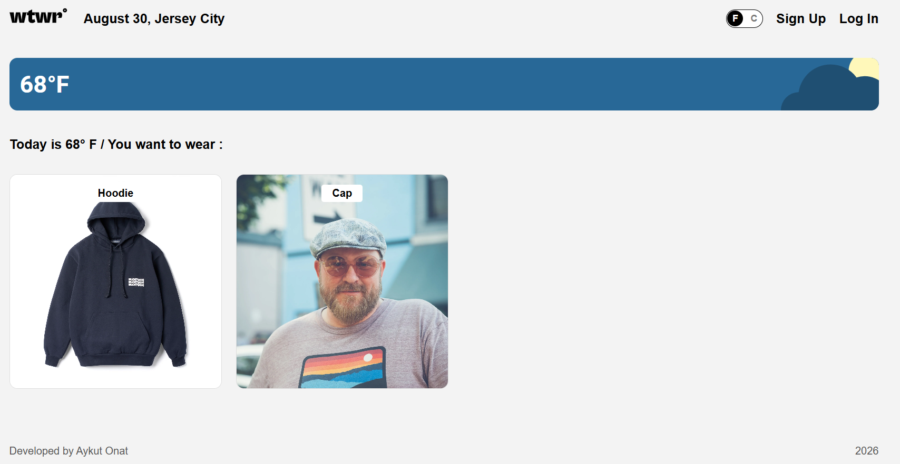
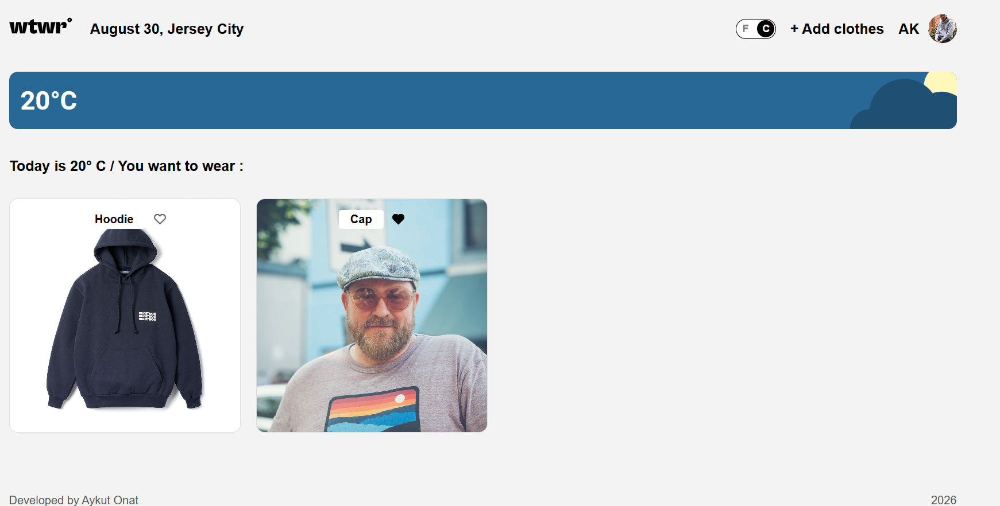
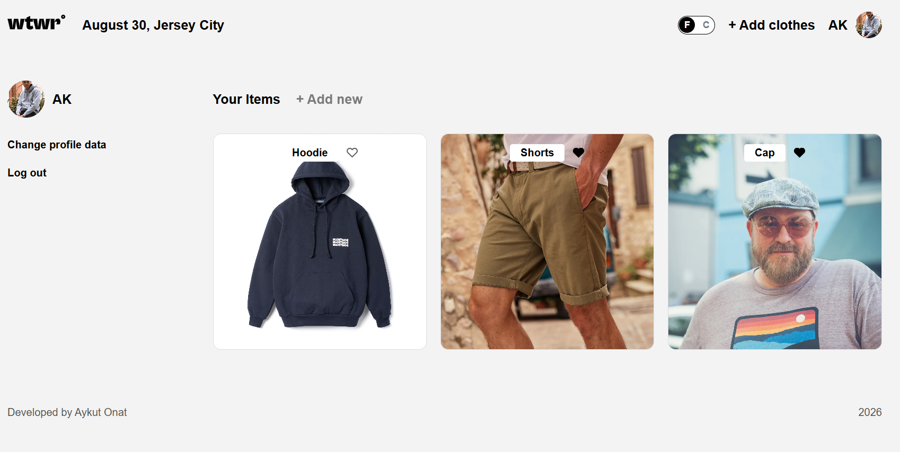
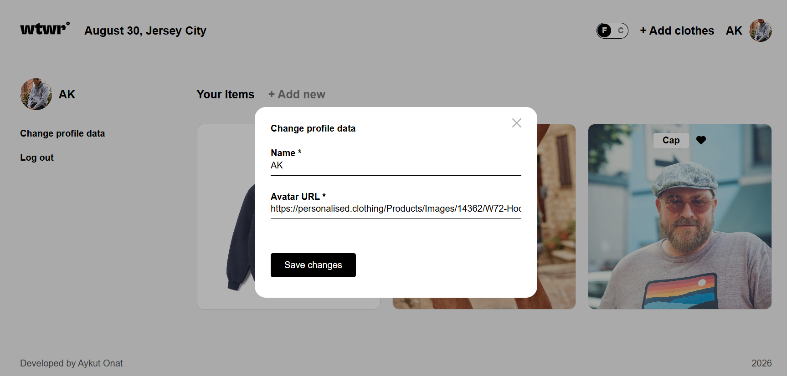

# WTWR (What to Wear) 🧥

### **What is this project?**

**WTWR** is a full-stack smart wardrobe assistant that helps you decide what to wear based on the actual weather. No more guessing if you need a jacket or just a T-shirt!

The app checks the real-time temperature in your city and suggests the best clothes from your personal closet for **Hot**, **Warm**, or **Cold** conditions.

---

### **Key Features**

- **JWT Authentication & Authorization:** Secure registration, sign-in, token validation on page load, and automated session persistence via local storage.
- **Protected Routes & User Profiles:** Dedicated `/profile` route that is fully protected and displays only the current user's clothing items, along with their avatar and name in the sidebar.
- **Profile Management:** Fully functional "Change profile data" modal allowing users to update their account details.
- **Interactive Wardrobe (Likes & Deletion):** Real-time liking system where state persists across page reloads, paired with authorization checks to delete owned garments.
- **Live Weather & Smart Filtering:** Connects to the OpenWeather API to fetch current local temperatures and automatically filters wardrobe items to match today's weather conditions.
- **Dynamic Form Validation:** Custom modals for adding garments, logging in, registering, and editing profiles with reactive submit buttons.
- **Modern UI:** Clean design featuring custom "floating" item labels and sleek form inputs built with BEM methodology.

---

### **Technologies Used**

- **Frontend:** React, Vite, React Router DOM, Advanced CSS (Flexbox & Absolute Positioning).
- **Backend:** Node.js, Express.js, MongoDB (RESTful API architecture).
- **Security:** JSON Web Tokens (JWT) for secure user sessions.
- **External APIs:** OpenWeather API for real-time temperature updates.

---

### **Project Preview**

#### **1. Main Dashboard**

#### **2. Item View & Details Modal**

#### **3. User Profile Page**

#### **4. Profile Update Modal**

---

### **Links**

💻 **[Frontend GitHub Repository](https://github.com/aonattt/se_project_react)**  
⚙️ **[Backend GitHub Repository](https://github.com/aonattt/se_project_express)**

---

### **How to Run it Locally**

1.  **Clone the project:** `git clone https://github.com/aonattt/se_project_react.git`
2.  **Install dependencies:** `npm install`
3.  **Launch the app:** `npm run start`

---

**Developed by Aykut Onat | 2026**
